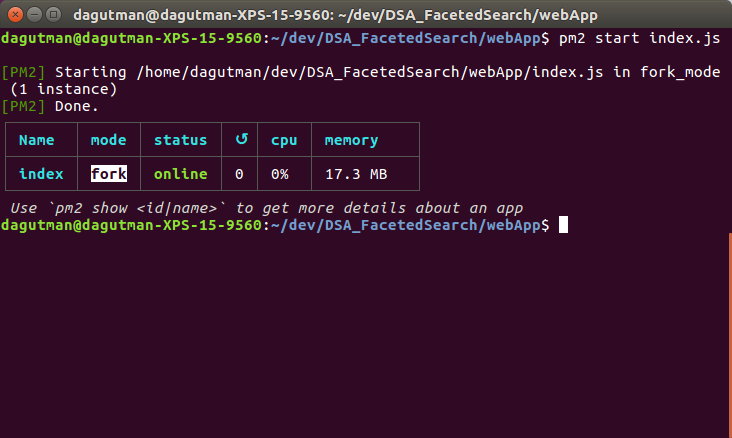
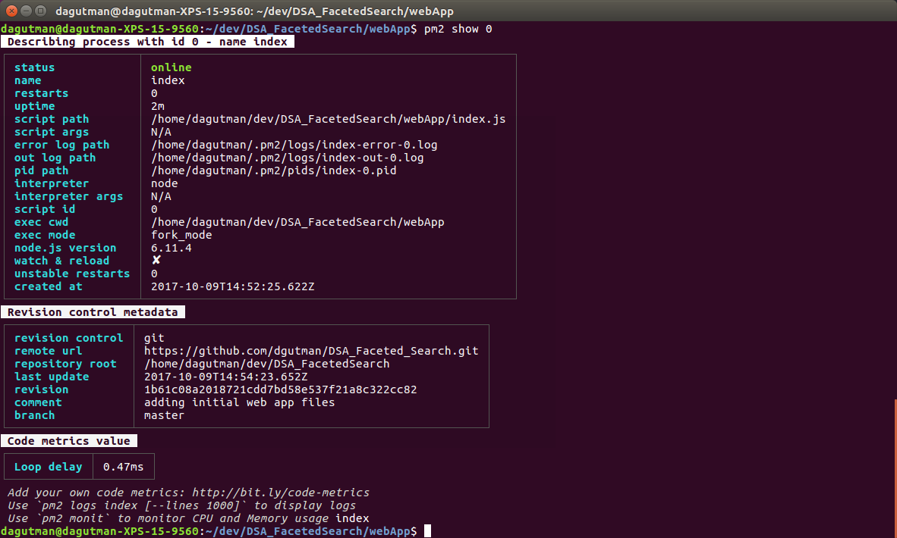

## Starting the faceted search viewer

# Here is what the running app should look like
go to http://localhost:8000/

 Note it has no data.. since I haven't loaded any yet.. I'll show that in
 the loadingData.md

# Using the pm2 node server currently

pm2 show <id|name>  so pm2 show 0 (if the index.js is the 0th process) or pm2 show index.js
Lists uptime/etc..

# Monitor the running process

pm2 monit 0  

# Deleting a process
pm2 delete 0
