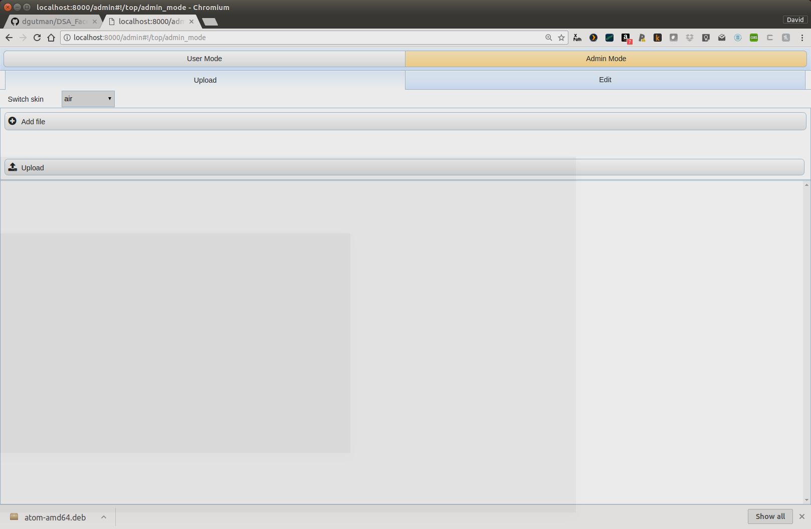
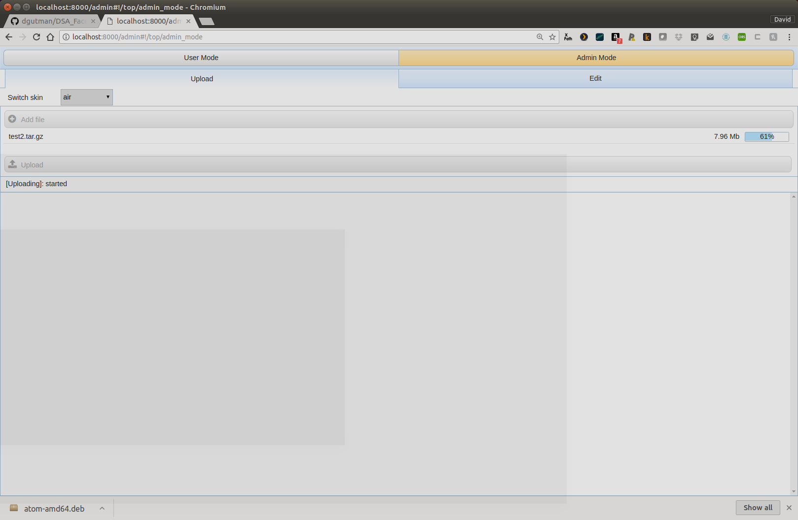
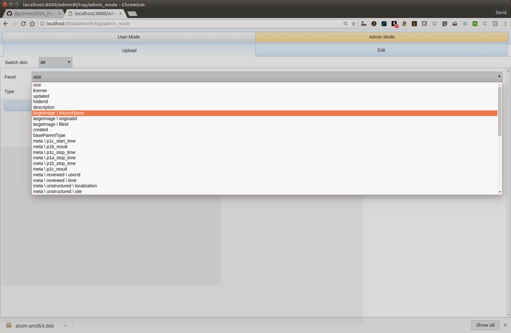
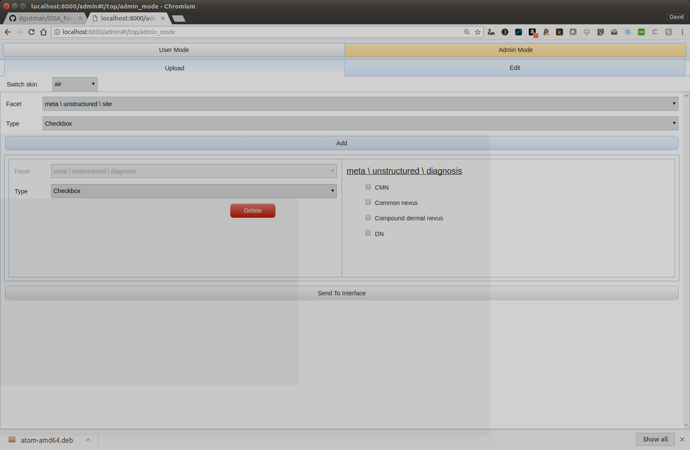
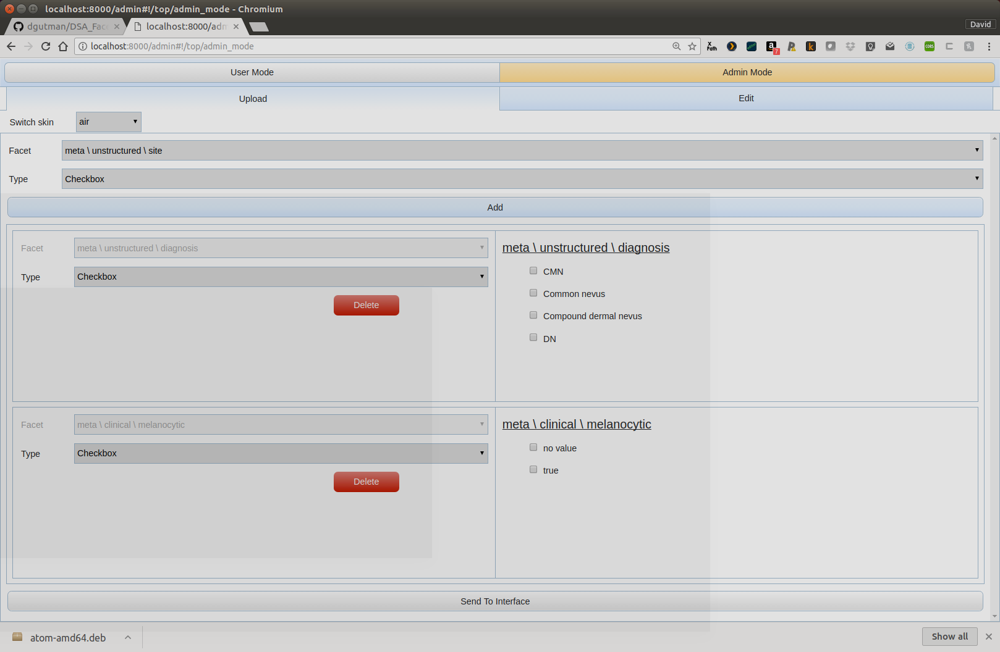
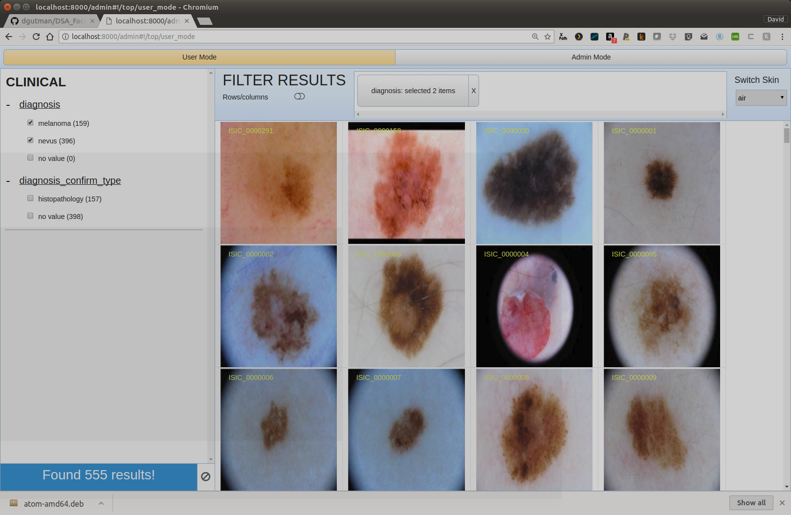
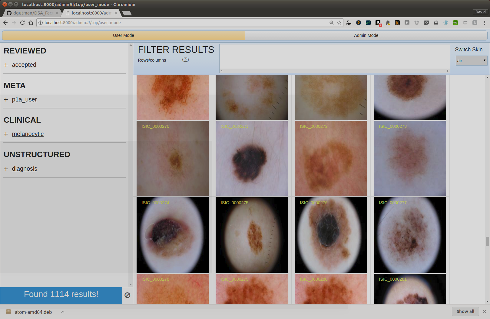

## Loading Test Data
For testing purposes, you can actually drag and drop a testing
file that contain a PNG/JSON pair
it is located in TestDataSets/test2.tar.gz

# Switch to admin mode

http://localhost:8000/admin  will toggle to admin mode

Note the button on the right

So add file (i.e. select the test2.tar.gz) and then click the upload button

So I clicked upload, now the cool part.... it generates a UI listing the possible
facets I can add

For a given attribute/facet, I can select the type of UI element I want to use
to view it.. i.e. radio, checkbox, range slider, and I hit add properties
one by one based on what makes sense for the UI data

For this example I just selected diagnosis, and then I added one more

and then scroll down and hit Send to Interface

On the left my facets are listed and as I click / select things, the UI updates with the relevant images

